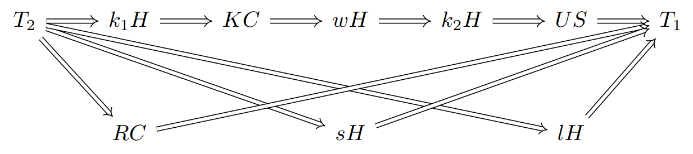

# Separation Axioms Among US

Steven Clontz  
University of South Alabama

2025 September 06  
[Set Theory and Topology in Messina](https://servizimift.unime.it/sttm/)

---

## But first, a word from our sponsor!

- The *Team-Based Inquiry Learning Resource Library*
  ([TBIL.org](https://tbil.org)) is a repository of free and open-source 
  evidence-based materials for active learning Precalculus, Calculus, and 
  Linear Algebra classrooms.
- This work was made possible through the support of 
  [National Science Foundation Award #2011807](https://nsf.gov/awardsearch/showAward?AWD_ID=2011807).

---

## Abstract

A standard introductory result is that Hausdorff spaces have the property 
US, that is, each convergent sequence has a unique limit. This paper 
explores several existing and new characterizations of separation axioms 
that are strictly weaker than Hausdorff but strictly stronger than US.

&nbsp;

Based upon joint work [0] with Marshall Williams.

[0] C., Williams, M. *Separation Axioms Among US.*
[Topology and its Applications, Volume 375, 2025.](
https://doi.org/10.1016/j.topol.2025.109467)

---

## Where our story begins.

In [1], Wilansky published a systematic overview of two properties strictly 
between $T_2$ and $T_1$: **KC (Kompacts are Closed)** and
**US (converging Sequences have Unique limits)**.

One may show that

$$T_2 \Rightarrow KC \Rightarrow US \Rightarrow T_1$$

with no arrows reversing.

&nbsp;

&nbsp;

[1] Wilansky A. Between $T_1$ and $T_2$. Amer Math Monthly. 1967;74:261-6. Available from: https://doi.org/10.2307/2316017.

---

## But why am I interested in this?

My dirty secret: I'm only a part-time topologist these days. 😢

&nbsp;

A major part of my active scholarly program is focused on
**digital research infrastructure** for mathematics, and I have a 
particular interest in **databases of research mathematics**. 💻

And my favorite database? The
[$\pi$-Base community database of topological counterexamples](https://topology.pi-base.org),
of course.

---

## What is needed to contribute properties like KC and US to the $\pi$-Base?

- Notability
  - [KC (P100)](https://topology.pi-base.org/properties/P000100) and 
    [US (P99)](https://topology.pi-base.org/properties/P000099) 
    are indeed properties recognized in the literature.
- Connections
  - The theorems $T_2\Rightarrow KC$, $KC\Rightarrow US$, and
    $US\Rightarrow T_1$ connect these properties to others known to
    $\pi$-Base.
- Counter-examples
  - Spaces (e.g.)
    [Cocountable topology on $\mathbb R$ (S17)](https://topology.pi-base.org/spaces/S000017),
    [Square of one-point compactificiation of $\mathbb Q$ (S31)](https://topology.pi-base.org/spaces/S000031),
    and
    [Cofinite topology on $\mathbb Z$ (S15)](https://topology.pi-base.org/spaces/S000017)
    witness that each implication does not reverse.

---

## Done! Now what?

Part of what's fun about contributing to $\pi$-Base today is that there's 
still so much ground to cover to catch up to the current state of the 
literature.

- It seems Patrick Rabau was the
  first to observe in 2021 [2]
  that the
  [**wH** (Weak Hausdorff, P143)](https://topology.pi-base.org/properties/P000143)
  property lies strictly between KC and US.
- Madison and Lawson define **kH** (k-Hausdorff) in [3], and showed it
  lives between $T_2$ and KC.
- Rezk also defines kH in [4], and showed it is implied by wH.

[2] Rabau, P. *Relationship between weak Hausdorff and US properties.* 
[Math StackExchange (2021).](https://math.stackexchange.com/questions/4267169/)

[3] Madison, B., Lawson, J. *Quotients of k-semigroups.*
[Semigroup Forum 9 (1974): 1-18.](http://eudml.org/doc/134055)

[4] Rezk, C. *Compactly generated spaces.*
[nLab (2018).](https://ncatlab.org/nlab/files/Rezk_CompactlyGeneratedSpaces.pdf)

---

---

## Cleaning up k-Hausdorff

On Math StackExchange [5], Rabau and I took a careful look at
the kH property. In both [2] and [3], a space was defined to be
k-Hausdorff provided that its diagonal is **k-closed**.

The trick is that there are two inequivalent definitions of k-closed
in the literature. Let's say a set is **$k_1$-closed** provided
its intersection with every compact subspace is closed, and
**$k_2$-closed** provided its intersection with the image of any
compact Hausdroff space is closed. We then obtain the respective
definitions for what we will now call
[**$k_1$H** ($k_1$-Hausdorff, P170)](https://topology.pi-base.org/properties/P000170)
and
[**$k_2$H** ($k_2$-Hausdorff, P171)](https://topology.pi-base.org/properties/P000171)

&nbsp;

[5] C, and Rabau, P.
*How are k-Hausdorff and weakly Hausdorff distinct?*
[Math StackExchange (2023).](https://math.stackexchange.com/questions/4760309/)

---

## Putting it together

$$T_2\Rightarrow k_1H \Rightarrow KC \Rightarrow wH \Rightarrow k_2H
\Rightarrow US \Rightarrow T_1$$

with no arrows reversing.
In fact:

[6] C.
*Non-Hausdorff T_1 Properties*
[arXiv (2024).](https://arxiv.org/abs/2312.08328)

---

## Generalizing US

Let's dig into another definition for $k_2H$:

> For every compact Hausdorff space $K$, continuous map $f:K\to X$,
and points $k,l\in K$ with $f(k)\not=f(l)$, there exist open neighborhoods
$U,V$ of $k,l$ with $f[U]\cap f[V]=\emptyset$.

Letting $K=\omega+1$ and we easily see why $k_2H\Rightarrow US$.
But what about other types of sequences?

---

## Transfinite sequences

Define a **transfinite sequence** to be a function from a limit
ordinal $\alpha$ into a topological space. Note that every
$\omega$-length (transfinite) sequence is **continuous**, but
longer transfinite sequences need not be.

A **limit** of a transfinite sequence is a point such that every
neighborhood contains a final tail of the sequence; the limit is
said to **converge** to this limit.

---

# <!-- fit --> Questions?

Thanks for listening! Find me at [Clontz.org](https://clontz.org).

