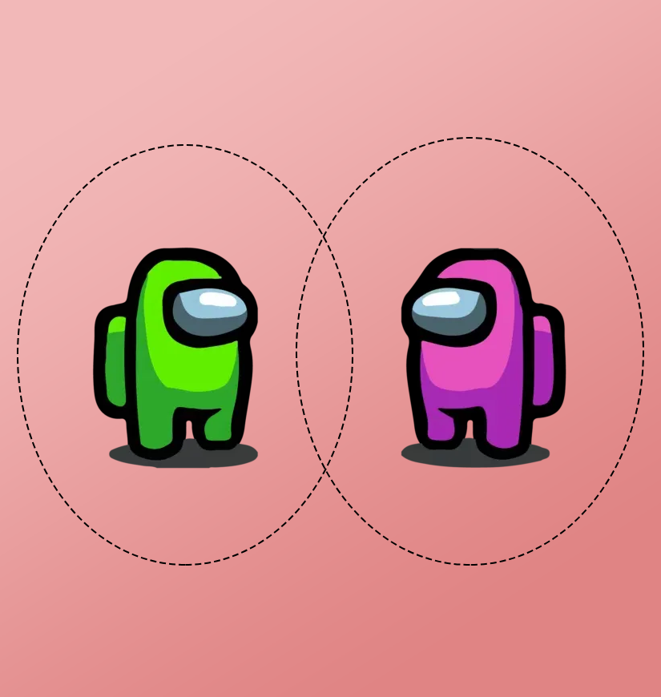

# Separation Axioms Among US

Steven Clontz
2025 
STTM 2025

---

## But first, a word from our sponsor!

- The *Team-Based Inquiry Learning Resource Library* ([TBIL.org](https://tbil.org)) is a repository of free and open-source evidence-based materials for active learning Precalculus, Calculus, and Linear Algebra classrooms.
- This work was made possible through the support of [National Science Foundation Award #2011807](https://nsf.gov/awardsearch/showAward?AWD_ID=2011807).

---

## Abstract

A standard introductory result is that Hausdorff spaces have the property US, that is, each convergent sequence has a unique limit. This paper explores several existing and new characterizations of separation axioms that are strictly weaker than Hausdorff but strictly stronger than US.

---

## Where our story begins.

In [0], Wilansky published a systematic overview of two properties strictly between $T_2$ and $T_1$: **KC (Kompacts are Closed)** and **US (converging Sequences have Unique limits)**.

One may show that

$$T_2 \Rightarrow KC \Rightarrow US \Rightarrow T_1$$

with no arrows reversing.

&nbsp;

&nbsp;

[0] Wilansky A. Between $T_1$ and $T_2$. Amer Math Monthly. 1967;74:261-6. Available from: https://doi.org/10.2307/2316017.

---

## But why am I interested in this?

My dirty secret: I'm only a part-time topologist these days. 😲

A big part of my active scholarly program is focused on **research infrastructure** for mathematics, and I have a particular interest in **databases of research mathematics**.

My favorite database through? The [$\pi$-Base community database of topological counterexamples](https://topology.pi-base.org).

---

## 6. Tables

| Column 1 | Column 2 |
| -------- | -------- |
| Item 1   | Item 2   |
| Item 3   | Item 4   |

---

## 7. Columns

## Left

- 1
- 2

## Right

- 3
- 4

---

## 8. Icons

<i class="fa-brands fa-twitter"></i> Twitter: 
<i class="fa-brands fa-mastodon"></i> Mastodon: 
<i class="fa-brands fa-linkedin"></i> LinkedIn: 
<i class="fa fa-window-maximize"></i> Blog: 
<i class="fa-brands fa-github"></i> GitHub: 

---

# 9. <!--fit--> Large Text

