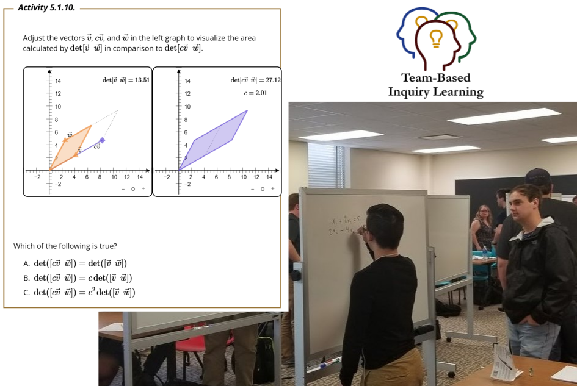
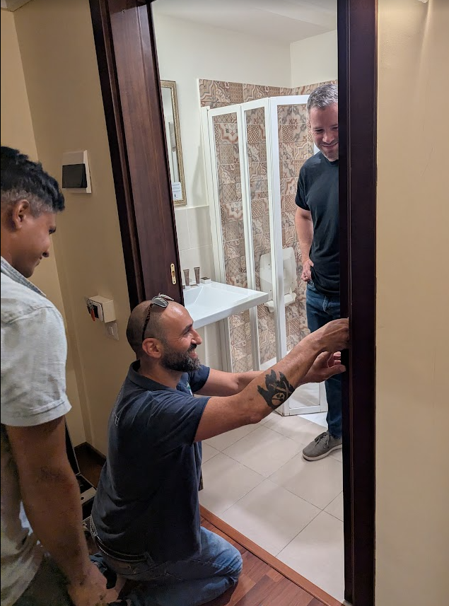
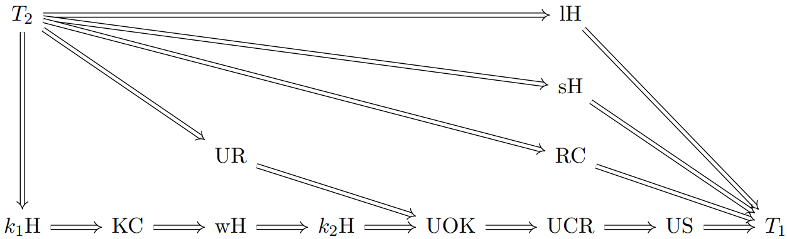

# Separation Axioms Among US

Steven Clontz  
University of South Alabama

2025 September 06  
[Set Theory and Topology in Messina](https://servizimift.unime.it/sttm/)

---

## But first, a word from our sponsor!

- The *Team-Based Inquiry Learning Resource Library*
  ([TBIL.org](https://tbil.org)) is a repository of free and open-source 
  evidence-based materials for active learning Precalculus, Calculus, and 
  Linear Algebra classrooms.
- That work (and this visit to STTM communicating it)
  was made possible through the support of 
  [National Science Foundation Award #2011807](https://nsf.gov/awardsearch/showAward?AWD_ID=2011807).

---

---

## Seeking: Special Session organizers for SumTopo 2026

SumTopo 2026 will be in Split, Croatia! We're seeking
organizers for a special session in General and Set-Theoretic
Topology. Email <steven@clontz.org> to volunteer or visit
[Clontz.org/SumTopo](https://clontz.org/sumtopo) to learn more.

---

## An apology:

This morning's schedule.

- 9:00am, Jocelyn: "Games!"
- 9:25am, Steven: who cares  
  ☝ **(you are here)**
- 9:50am, Michał: "Games!"

I usually prefer topological games too, but there's a reason
I'm switching gears today!

---

## PSA: Careful that you can unlock your bathroom doors...

Don't be a victim like Will Brian!

---

# Now back to your scheduled programming...

---

## Abstract

A standard introductory result is that Hausdorff spaces have the 
property  US, that is, each convergent sequence has a unique 
limit. Here we will explore several existing and new 
characterizations of separation axioms that are strictly weaker 
than Hausdorff but strictly stronger than US.

&nbsp;

*Based upon joint work [0] with Marshall Williams.*

[0] C., Williams, M. *Separation Axioms Among US.*
[Topology and its Applications, Volume 375, 2025.](
https://doi.org/10.1016/j.topol.2025.109467)

---

## Where our story begins.

In [1], Wilansky published a systematic overview of two properties strictly 
between $T_2$ and $T_1$: **KC (Kompacts are Closed)** and
**US (converging Sequences have Unique limits)**.

One may show that

$$T_2 \Rightarrow KC \Rightarrow US \Rightarrow T_1$$

with no arrows reversing.

&nbsp;

&nbsp;

[1] Wilansky A. Between $T_1$ and $T_2$. Amer Math Monthly. 1967;74:261-6. Available from: https://doi.org/10.2307/2316017.

---

## But why am I interested in this?

My dirty secret: I'm only a part-time topologist these days. 😢

&nbsp;

A major part of my active scholarly program is focused on
**digital research infrastructure** for mathematics, and I have a 
particular interest in **databases of research mathematics**. 💻

And my favorite database? The
[$\pi$-Base community database of topological counterexamples](https://topology.pi-base.org),
of course.

---

## What is needed to contribute properties like KC and US to the $\pi$-Base?

- Notability
  - [KC (P100)](https://topology.pi-base.org/properties/P000100) and 
    [US (P99)](https://topology.pi-base.org/properties/P000099) 
    are indeed properties recognized in the literature.
- Connections
  - The theorems $T_2\Rightarrow KC$, $KC\Rightarrow US$, and
    $US\Rightarrow T_1$ connect these properties to others known to
    $\pi$-Base.
- Counter-examples
  - Spaces (e.g.)
    [Cocountable topology on $\mathbb R$ (S17)](https://topology.pi-base.org/spaces/S000017),
    [Square of one-point compactificiation of $\mathbb Q$ (S31)](https://topology.pi-base.org/spaces/S000031),
    and
    [Cofinite topology on $\mathbb Z$ (S15)](https://topology.pi-base.org/spaces/S000017)
    witness that each implication does not reverse.

---

## Done! Now what?

Part of what's fun about contributing to $\pi$-Base today is that there's 
still so much ground to cover to catch up to the current state of the 
literature.

- It seems Patrick Rabau was the
  first to observe in 2021 [2]
  that the
  [**wH** (Weak Hausdorff, P143)](https://topology.pi-base.org/properties/P000143)
  property lies strictly between KC and US.
- Madison and Lawson define **kH** (k-Hausdorff) in [3], and showed it
  lives between $T_2$ and KC.
- Rezk also defines kH in [4], and showed it is implied by wH.

&nbsp;

[2] Rabau, P. *Relationship between weak Hausdorff and US properties.* 
[Math StackExchange (2021).](https://math.stackexchange.com/questions/4267169/)

[3] Madison, B., Lawson, J. *Quotients of k-semigroups.*
[Semigroup Forum 9 (1974): 1-18.](http://eudml.org/doc/134055)

[4] Rezk, C. *Compactly generated spaces.*
[nLab (2018).](https://ncatlab.org/nlab/files/Rezk_CompactlyGeneratedSpaces.pdf)

---

---

## Cleaning up k-Hausdorff

On Math StackExchange [5], Rabau and I took a careful look at
the kH property. In both [2] and [3], a space was defined to be
k-Hausdorff provided that its diagonal is **k-closed**.

The trick is that there are two inequivalent definitions of k-closed
in the literature. Let's say a set is **$k_1$-closed** provided
its intersection with every compact subspace is closed, and
**$k_2$-closed** provided its intersection with the image of any
compact Hausdroff space is closed. We then obtain the respective
definitions for what we will now call
[**$k_1$H** ($k_1$-Hausdorff, P170)](https://topology.pi-base.org/properties/P000170)
and
[**$k_2$H** ($k_2$-Hausdorff, P171)](https://topology.pi-base.org/properties/P000171)

&nbsp;

[5] C, and Rabau, P.
*How are k-Hausdorff and weakly Hausdorff distinct?*
[Math StackExchange (2023).](https://math.stackexchange.com/questions/4760309/)

---

## Putting it together

As it turns out, we have

$$T_2\Rightarrow k_1H \Rightarrow KC \Rightarrow wH \Rightarrow k_2H
\Rightarrow US \Rightarrow T_1$$

with no arrows reversing.
In fact:

[6] C.
*Non-Hausdorff $T_1$ Properties*.
[arXiv (2024).](https://arxiv.org/abs/2312.08328)
(Under revision to resubmit, I promise!)

---

## Generalizing US

Let's dig into another definition for $k_2H$:

> For every compact Hausdorff space $K$, continuous map $f:K\to X$,
and points $k,l\in K$ with $f(k)\not=f(l)$, there exist open neighborhoods
$U,V$ of $k,l$ with $f[U]\cap f[V]=\emptyset$.

Let $K=\omega+1$ and we easily see why $k_2H\Rightarrow US$.

---

## What about other types of sequences?

In the Carolinas virtual topology seminar (soon to be revived by
Lynne Yengulalp and Jocelyn Bell) I presented this work.
Alan Dow asked if I'd considered longer sequences.

I considered this question rather SUS (Strongly Uniquely
Sequential), but wrote it up on Math StackExchange anyway [7].
The post was popular, likely because of all the inside jokes 
[ඞ](https://knowyourmeme.com/memes/subcultures/among-us)
I baked into it. But the attention eventually led
user @MW (my now-coauthor Marshall Williams) to find
the answer.

&nbsp;

[7] C., Williams, M. "Is there anyone among us who can identify a certain
SUS space?"
[Math StackExchange (2023)](https://math.stackexchange.com/questions/4778063/).

---

## Transfinite sequences

Define a **transfinite sequence** to be a function from a limit
ordinal $\alpha$ into a topological space. Note that every
$\omega$-length (transfinite) sequence is **continuous**, but
longer transfinite sequences need not be.

A **limit** of a transfinite sequence is a point such that every
neighborhood contains a final tail of the sequence; the 
transfinite sequence is said to **converge** to this limit.

---

## UR and UCR

This suggests two "SUS" candidates:

- A space is **UR (Unique Radial limits)** provided the
limit of every converging transfinite sequence is unique.

- A space is **UCR (Unique Continuously-Radial limits)**
provided the limit of every converging continuous transfinite
sequence is unique.

We see immediately that
$$T_2\Rightarrow UR \Rightarrow UCR \Rightarrow US.$$

> (Our paper also considers a property UOK intermediate to
> UR & UCR, which we omit here.)

---

## Counterexamples

- The space $\omega_1+1$ with its endpoint doubled
([S37](https://topology.pi-base.org/spaces/S000037)) is
US but not UCR.

- Take a compact, Hausdorff, sequentially discrete
(convergent sequences are eventually constant,
[P167](https://topology.pi-base.org/properties/P167)) with
a non-isolated point (e.g. $\beta\omega$,
[S108](https://topology.pi-base.org/spaces/S108)). Doubling
this point produces a UCR but not $T_2$ space.
  - To see this, note sequentially discrete implies all
    converging continuous transfinite sequences are eventually
    constant, and thus (given $T_1$) have a unique limit.

---

## UCR but not UR

In fact, this example fails to be UR. Note that every
non-isolated point in a compact Hausdorff space is
**radially accessible**, that is, there is a transfinite
sequence (not necessarily continuous) of distinct points
converging to it.

- Idea: take a point, forbid a neighborhood around it whose
closure misses the isolated point, take a second (non-forbidden)
point, rinse, repeat...

So, take the doubled point, and take a transfinite sequence
of distinct points
converging to it in $\beta\omega$: this witnesses $\neg$UR.

---

## Where does UCR fit?

Just as $K=\omega+1$ witnesses the proof that
$k_2H\Rightarrow US$, we may consider $K_\kappa=\kappa+1$
to convince ourselves that $k_2H\Rightarrow UCR$.
Therefore:

&nbsp;

$$T_2\Rightarrow k_1H \Rightarrow KC \Rightarrow wH \Rightarrow 
k_2H \Rightarrow UCR \Rightarrow US \Rightarrow T_1$$

---

## Where does UR fit?

Interestingly, it doesn't! At least no more than we've
already shown. Indeed, we can show

with no arrows reversing or missing.

---

## Proof

We'll ignore the (heretofore undefined) lH, sH, RC,
and UOK properties.
So I owe you examples which are $k_1H$ but not UR, and
UR but not even $k_2H$.

### $k_1H$ but not UR

The "standard" example of a $k_1H$ (which may be characterized
by compact subspaces are all Hausdorff) which fails $T_2$ is not
UR: consider the co-countable topology on an uncountable
set ([S17](https://topology.pi-base.org/spaces/S000017)).
Here compacta are finite $T_1$ and thus $T_2$. But
non-trivial transfinite sequences of uncountable length
converge to every point of the space, violating UR.

---

### UR but not $k_2H$

To obtain an example which is UCR which failed UR,
we "cheated" by doubling a point of
the remainder in $\beta\omega$. Note that this space
also fails $k_2H$: consider the natural maps from $\beta\omega$
to this space that differ only on this doubled non-isolated point.

So to obtain a UR space which fails $k_2H$, we want to use the 
same trick to violate $k_2H$, but avoid transfinite sequences
with non-unique limits.

This can be done by doubling *every* point of 
$\beta\omega\setminus\omega$. In this space, converging 
transfinite sequences are either eventually constant, or
eventually live in one of the two copies of 
$\beta\omega\setminus\omega$, and thus converge within that
copy to a unique limit. $\square$

---

# My pitch

While sub-Hausdorff separation axioms are worthy
of study independently, I'm more interested
in pitching the methodology that inspired this investigation.

Mary Ellen Rudin once said in her review of
*Counterexamples in Topology* (paraphrased):

> Topology is a dense forest of counterexamples.
> A usable map of the forest is a fine thing.

We hope that [$\pi$-Base](https://topology.pi-base.org)
can be this map for the modern era. Not only does it
help mathematicians find answers, it is also an incredibly
useful tool for discovering *questions*, especially for
student/early-career folks. Contributing to the database
also builds "real world" (cough) tech
skills for students who may end up outside of research.

---

# <!-- fit --> Questions?

Thanks for listening! Find me at [Clontz.org](https://clontz.org).

